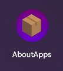

<h1 align="center">AboutApps</h1>

    

**AboutApps** provides information about the apps installed on your device.

- 🗃️ View app information including name, package name, version, version code, and when it was first installed and last updated
- 🧐 Search for an app by package name
- 📦 Open the Settings screen for this app, or open the app directly

## Screenshots

### Dark mode

### Light mode

